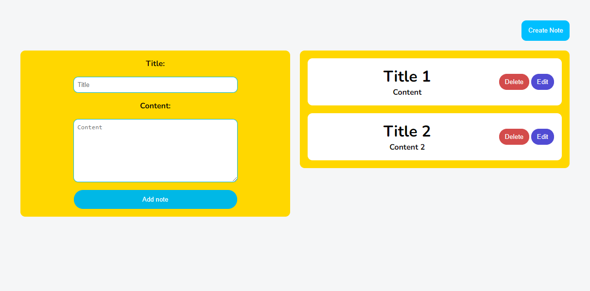
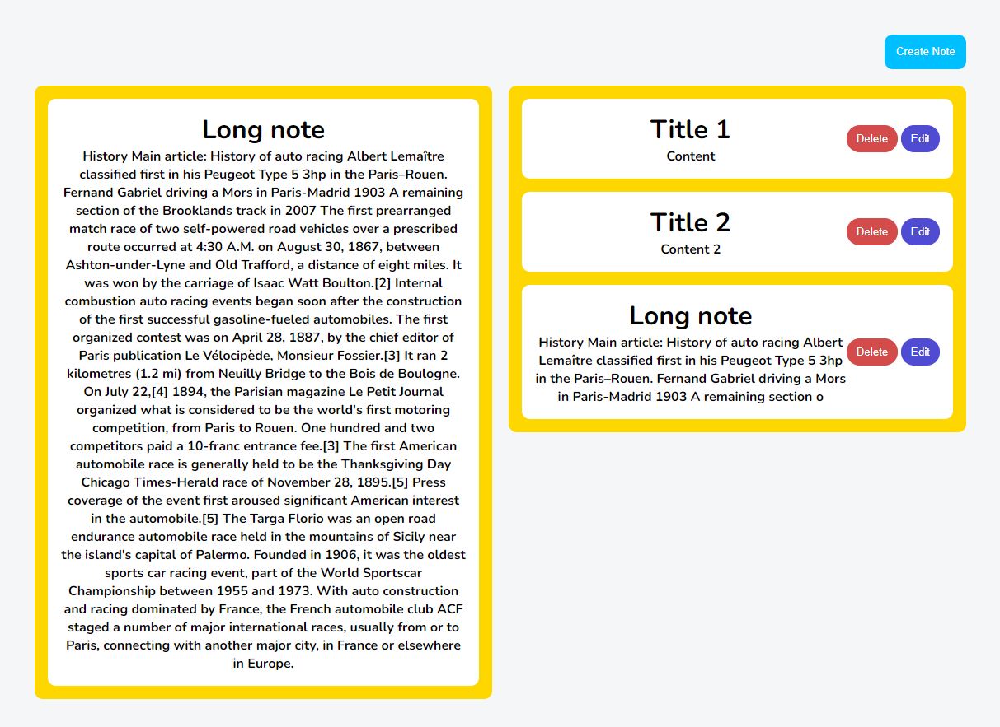
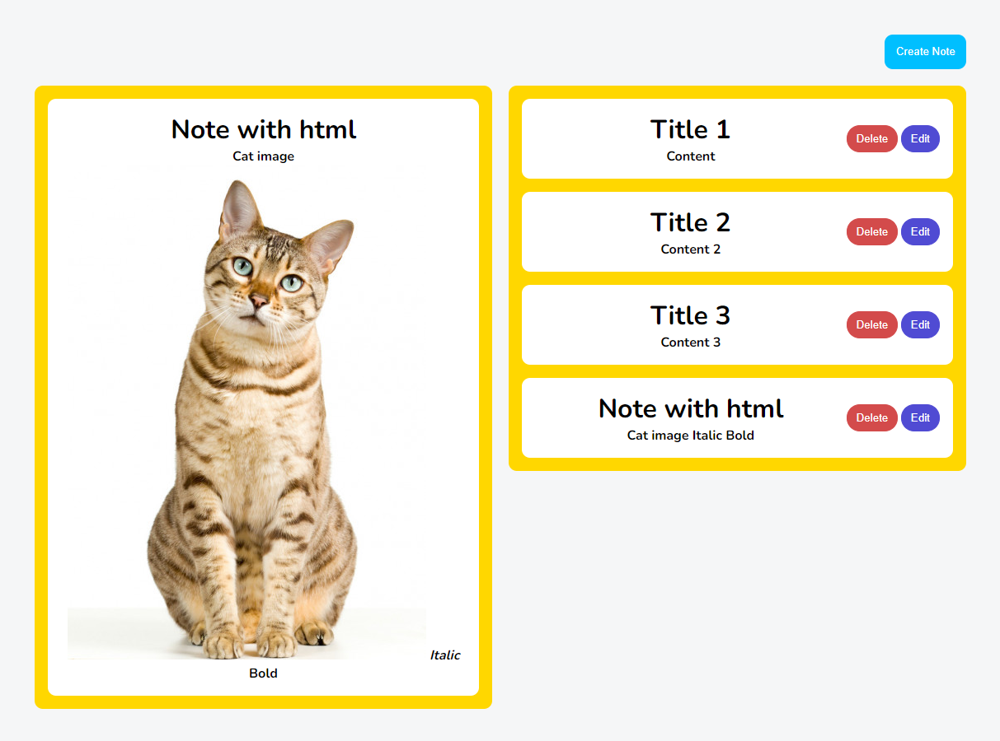
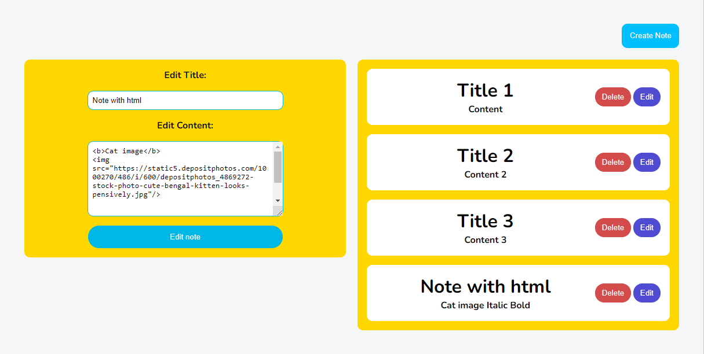

# Тестовое задание для курса React

Были реализованы следующие функции:
- создание заметки
- редактирование заметки
- удаление заметки
- колонка с превью заметок
- просмотр полной заметки
- отображение HTML текста при просмотре заметки
- удаление нежелательных HTML тегов таких, как iframe и script
- проверка длинны Title и Content при создании и редактировании заметки
- сохранение состояния приложения в local storage браузера

Ниже представлены несколько экранов с демонстрацией приложения.

### Форма для создания заметки в левой колонке, превью заметок в правой колонке

### Демонстрация предпросмотра на примере длинной заметки (Long note)

### Отображение HTML при просмотре заметки и редактирование той же заметки

# Запуск приложения
Выполнить npm run start из попки проекта
